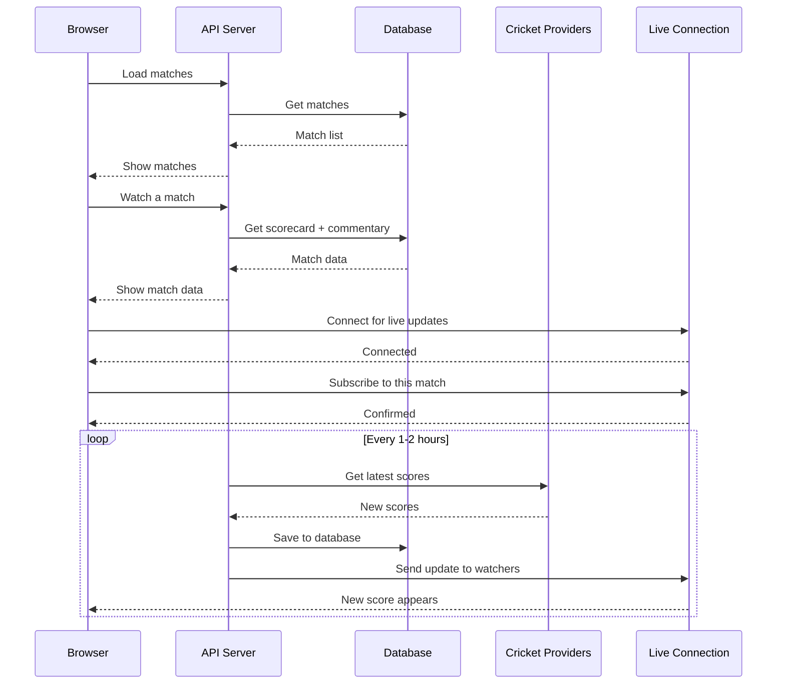

# Sportz — Real time Sports data

Live cricket scores, full scorecard and commentary, updated live without refresh.

**Live:** Frontend https://sportz-frontend-iota.vercel.app • API https://sportz-websocket-2wq7.onrender.com

Two parts: `sportz-websocket` (backend) + `sportz-frontend` (website).

---

## How it works

1. You open the website → it loads the list of matches.
2. You click **Watch Live** → it shows that match's scorecard and commentary and starts listening for live updates.
3. The server checks cricket providers every couple of hours, saves the latest scores to the database, and pushes updates to everyone watching that match.

## Sequence Diagram



---

## Tools Used

| Tool | What it does |
|------|--------------|
| **Node.js + Express** | Runs the API server |
| **WebSocket (ws)** | Live push for scores and commentary |
| **Postgres (Neon) + Drizzle** | Stores matches and commentary |
| **Zod** | Checks all inputs are valid |
| **Arcjet** | Security — blocks bots, attacks and spam |
| **dotenv** | Loads secret keys safely |
| **CricAPI + Cricbuzz (RapidAPI)** | Gives real cricket data |
| **Vite + React + TypeScript** | Builds the website |
| **Render + Vercel + Cloudflare** | Hosts API, website and makes them fast |

---

## Backend Security

- **Blocks bots and attacks** before they reach the database.
- **Limits how fast someone can call the API** (too many requests → blocked).
- **Protects the live connection** so one person can't flood it.
- **Only allows the real website** to call the API (CORS locked to Vercel).
- **Checks every input** (like match id and scores) before saving.
- **Uses safe database queries** so no one can inject SQL.
- **Keeps secrets on the server only** — keys are never sent to the browser.
- **Handles crashes** so one error doesn't kill the server.

---

## Run Locally

```bash
# backend
npm install
npm run db:migrate
npm run dev

# frontend (in ../sportz-frontend)
npm install
npm run dev
```

No code or secret keys are needed in the README — just install and run.

---

MIT — Made for learning and demos.
