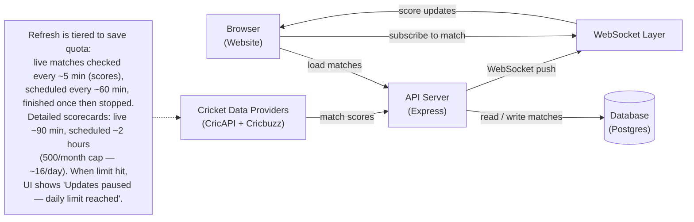

# Sportz — Cricket Scores, Without the Refresh Button

Sportz is a simple website for following cricket matches. Pick any match, hit Watch, and the score and scorecard update on their own — no page reloads. It's built for fans who want to glance at scores during work or class, and for recruiters or students who want to see a small, honest example of a WebSocket-powered app. Under the hood, instant delivery and periodic data fetching are separate: when new data arrives it's pushed to your browser instantly, but the data itself is fetched from cricket providers on a schedule (more often for games in progress, less often otherwise).

**Live:** Frontend https://sportz-frontend-iota.vercel.app · API https://sportz-websocket-2wq7.onrender.com

Two parts: `sportz-frontend` (the website) + `Sportz` (the API server). Either can run on its own.

---

## How it works

1. You open the website — it loads the list of matches from the server.
2. You click **Watch Live** (or **View Match** / **View Recap**) on any card — the site fetches that match's detailed scorecard and commentary.
3. The site opens a persistent connection and tells the server "send me updates for this match."
4. In the background, the server periodically asks outside cricket data providers for the latest scores and saves them.
5. If something actually changed, the server pushes the new score or scorecard to everyone watching that match — it appears on your screen right away. Each card shows "Updated Xm ago" so you can see how fresh the data is, or "Updates paused — daily limit reached" if the provider quota is exhausted for the day.

---

## Data flow



> The note above is the only place intervals are mentioned — check the code if you change them, so the diagram doesn't go stale.

---

## Tools Used

| Tool                      | Purpose                                                    |
| ------------------------- | ---------------------------------------------------------- |
| Node.js + Express         | Runs the API that the website talks to                     |
| WebSocket                 | Pushes score changes to browsers instantly without polling |
| Postgres + Drizzle        | Stores matches, scores, and commentary                     |
| Zod                       | Makes sure incoming data has the right shape               |
| Arcjet                    | Blocks bots and abusive traffic                            |
| CricAPI + Cricbuzz        | Outside sources for real cricket scores and scorecards     |
| React + Vite + TypeScript | Builds the website you see in the browser                  |
| Render + Vercel           | Hosts the API and the website                              |

---

## Security

- Automated bot and attack protection sits in front of both the API and the live connection.
- Rate limiting slows down anyone making too many requests too quickly.
- The live connection has its own stricter limit so one browser can't flood it.
- Only the official website is allowed to call the API from a browser.
- Every input (like a match id or a new score) is validated before it's saved.
- Database queries are parameterized, so injected commands can't run.
- Secret keys stay on the server and are never sent to the browser.
- The server handles crashes gracefully so one bad request doesn't bring everything down.

---

## Run Locally

```bash
# backend — from the Sportz folder
npm install
npm run db:migrate
npm run dev

# frontend — from the sportz-frontend folder
npm install
npm run dev
```

No keys or extra setup are shown here — you'll need your own provider keys and a database URL in an env file to fetch real cricket data. The website will still load without them, but scores won't update until the providers are configured.

---

MIT — Made for learning and demos.
