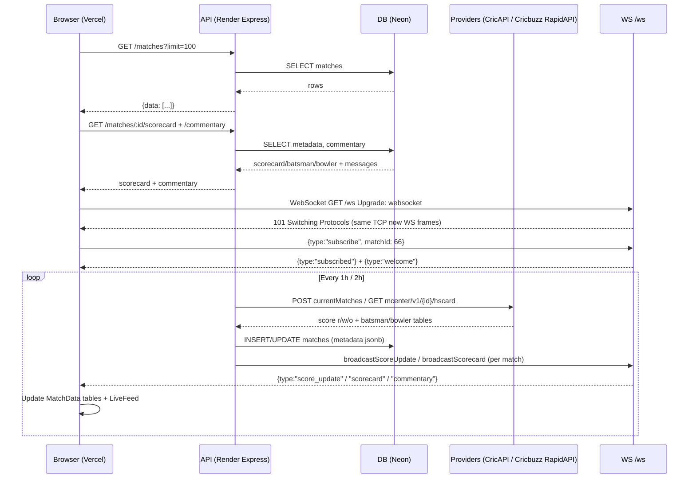

# Sportz — Real time Sports data

Live cricket scores + full scorecard (overs, batsman, bowler, runs, wickets) & commentary, pushed live over WebSocket.

**Live:** Frontend https://sportz-frontend-iota.vercel.app • API https://sportz-websocket-2wq7.onrender.com • WS `wss://sportz-websocket-2wq7.onrender.com/ws`

Repos: `sportz-websocket` (this, Node) + `sportz-frontend` (Vite + React in `../sportz-frontend`).

---

## How it works (simple)

1. Browser opens `https://sportz-frontend-iota.vercel.app` → fetches `GET /matches` from Render.
2. Click `Watch Live` → `GET /matches/:id/scorecard` + `GET /matches/:id/commentary` + `subscribe` over `wss://.../ws`.
3. Server polls cricket providers every `1h` (match list) + `2h` (scorecard) → saves to Neon `matches.metadata` → pushes `score_update / scorecard / commentary` to subscribed browsers.

## Sequence Diagram



---

## Tools Used

| Tool | For |
|------|-----|
| **Node.js + Express 5** | REST API (`/matches`, `/commentary`, `/scorecard`) |
| **ws 8** | WebSocket `/ws` (`noServer`, `maxPayload 1MB`, `30s ping/pong`) |
| **pg + drizzle-orm / drizzle-kit** | Postgres queries + migrations `drizzle/*.sql` |
| **Neon Postgres** | Serverless DB (`sslmode=require`) |
| **Zod 4** | Validates `limit`, `matchId`, `createMatch` (`end>start`) |
| **Arcjet** | Bot / WAF / Rate limit (see Security) |
| **apminsight** | APM `AgentAPI.config()` |
| **dotenv** | Env `process.env` |
| **CricAPI** | `currentMatches` totals `100/day` |
| **Cricbuzz via RapidAPI** | `mcenter/v1/{id}/hscard` full scorecard `500/month` |
| **Vite + React 19 + TypeScript** | Frontend `sportz-frontend` (`MatchData` tabs) |
| **Render / Vercel / Cloudflare** | API / UI / Proxy |

---

## Backend Security (simple)

- **Arcjet:** `shield` (WAF) + `detectBot` (allows `SEARCH_ENGINE/PREVIEW`) + `slidingWindow` rate limit — `50 req/10s` for HTTP, `5 req/2s` for WS upgrade (`src/arcjet.js`). Blocks before DB.
- **WS upgrade gate:** Checks `req.url startsWith /ws` then `wsArcjet.protect()` → `429/403` + `destroy()` (`src/ws/server.js`). `maxPayload 1MB`, `readyState OPEN` guard, `invalid_json` check.
- **CORS:** Locked to `https://sportz-frontend-iota.vercel.app` (`src/index.js`), `OPTIONS → 204`.
- **Validation:** All query/body/params via `Zod` (`src/validation/`) → `400` never hits DB. `MAX_LIMIT 100`.
- **DB safe:** Drizzle parameterized queries, `Pool max:10 keepAlive`, `external_id unique`, `metadata jsonb`, `.env` ignored, migrations versioned.
- **Platform:** `keepAlive 65s` for Render, `uncaughtException/unhandledRejection` → `500`, quota guards `90/100` + dedup avoids spam.
- **Secrets:** Provider keys (`CRICKETDATA_API_KEY`, `CRICBUZZ_API_KEY`) are server-only (`process.env`), never `VITE_` → never in browser.

---

## Run Locally

```bash
# backend
cd sportz-websocket
npm install
# create .env (see below)
npm run db:migrate
npm run dev        # http://localhost:8000  ws://localhost:8000/ws
npm run seed       # optional: API_URL=http://localhost:8000 node src/seed/seed.js

# frontend
cd ../sportz-frontend
npm install
echo 'VITE_API_BASE_URL=http://localhost:8000
VITE_WS_BASE_URL=ws://localhost:8000/ws' > .env
npm run dev        # http://localhost:5173
```

**Backend `.env`**

```
DATABASE_URL=postgresql://...neon.tech/neondb?sslmode=require
ARCJET_KEY=ajkey_...
ARCJET_ENV=production
CRICKETDATA_API_KEY=f0cd...
CRICBUZZ_API_KEY=1f4a...
CRICBUZZ_HOST=cricbuzz-cricket.p.rapidapi.com
```

On Render add same vars, on Vercel add `VITE_*` then redeploy.

---

## Folder

```
src/
  index.js         # Express + CORS + WS + poll start
  arcjet.js        # shield / bot / rate limits
  routes/          # matches.js, commentary.js, scorecard.js
  ws/server.js     # subscribe, broadcast, heartbeat
  jobs/cricketPoll.js # 1h currentMatches + 2h scorecard
  providers/       # cricketdata.js, cricbuzz.js
  db/schema.js     # matches(metadata jsonb), commentary
  validation/      # Zod
drizzle/           # 0001_external_id, 0002_metadata
```

MIT
