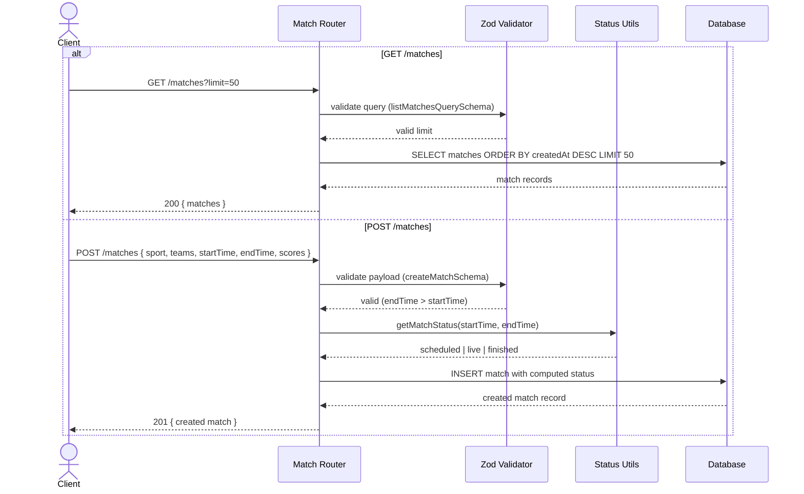

# Sportz — Commit `ecc1b86` ("Add matches endpoints")

## Walkthrough

<details>
<summary>Click to expand the full walkthrough</summary>

This commit wires up the first real API surface of Sportz: two endpoints on `/matches`, built in four layers. One new dependency (`zod`), three new files, one modified entrypoint.

### 1. Entry point — `src/index.js`

The Express app now mounts the router:

```js
app.use('/matches', matchRouter)
```

So every route defined in `src/routes/matches.js` lives under the `/matches` prefix. `express.json()` middleware (line 9) parses JSON bodies before anything else runs — that's what makes `req.body` available to POST.

### 2. Validation — `src/validation/matches.js`

Zod schemas are the trust boundary; nothing reaches the DB without passing through one:

- **`listMatchesQuerySchema`** — validates `?limit=`, coercing the string `"5"` to number `5`, requiring a positive int ≤ 100, optional.
- **`createMatchSchema`** — requires `sport`, `homeTeam`, `awayTeam`, plus `startTime`/`endTime` as ISO date strings (checked by regex + `Date.parse`). Scores are optional nonnegative ints. A `.superRefine` adds a cross-field rule: `endTime` must be strictly after `startTime`.
- **`updateScoreSchema`** and **`matchIdParamSchema`** are defined but unused yet — presumably for PATCH/GET-by-id routes in a future commit.

### 3. Status logic — `src/utils/match-status.js`

`getMatchStatus(start, end, now)` derives match state purely from clock comparison:

| Condition | Status |
|---|---|
| `now < start` | `"scheduled"` |
| `start <= now < end` | `"live"` |
| `now >= end` | `"finished"` |

Invalid dates return `null` instead of throwing. `syncMatchStatus` is a helper that updates a stored status only when it changed — also not wired into any route yet.

### 4. Routes — `src/routes/matches.js`

#### `GET /matches`

1. Parse `req.query` against `listMatchesQuerySchema`; on failure → 400 with error details.
2. Clamp limit to hard cap 100 (`MAX_LIMIT`).
3. Drizzle query: `db.select().from(matches).orderBy(desc(createdAt)).limit(limit)` → newest first.
4. Respond `{ data }`; any DB error → generic 500 (details intentionally omitted).

#### `POST /matches`

1. Validate body with `createMatchSchema`; failure → 400.
2. Insert into `matches`, converting ISO strings to `Date` objects, defaulting scores to `0`, and stamping initial status via `getMatchStatus`.
3. `.returning()` gives back the inserted row → respond 201 with it.

### Notable design points

- **Status is derived at insert time, not stored-and-updated** — a match created mid-game already says `"live"`. The tradeoff: statuses go stale (a scheduled match stays "scheduled" until something re-checks). That's exactly what the dormant `syncMatchStatus` is for later.
- Errors are stringified Zod/DB objects (`JSON.stringify(parsed.error)`) rather than shaped responses — fine for dev, worth revisiting before production.
- The commit also left two timestamp comments in index.js (`50:10`, `1:39:04`) — looks like YouTube tutorial positions.

</details>

## Sequence Diagram

<details>
<summary>Click to expand the sequence diagram</summary>



</details>
